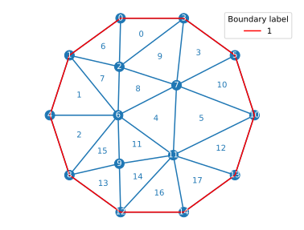

# pyFreeFem

pyFreeFem is a simple Python wrapper for the finite-element software [FreeFem++](https://freefem.org/). It helps importing and exporting meshes and finite-element matrices to and from FreeFem++. This library can only handle two-dimensional finite-element spaces.

Here is an example of its use:

[*Boltzmann Distribution of Sediment Transport*](http://dx.doi.org/10.1103/PhysRevLett.123.014501), A. Abramian, O. Devauchelle, G. Seizilles, E. Lajeunesse, Physical Review Letters, 123, 014501, 2019 [[arXiv]](https://arxiv.org/pdf/1907.01880)

## Quick example

Run FreeFem++ from Python:

```python
import pyFreeFem as pyff

FreeFem_output = pyff.run_FreeFem( 'cout << "Hello world!" << endl;' )

print(FreeFem_output)
```
```console
>>> Hello world!
```

## Create mesh

FreeFem++ attributes labels to nodes, triangles and boundaries. pyFreeFem includes a mesh class inherited from matplotlib.Triangulation which keeps track of these labels.

```python
import pyFreeFem as pyff
import matplotlib.pyplot as pp

edp_str = '''
border Circle( t = 0, 2*pi ){ x = cos(t); y = sin(t); }
mesh Th = buildmesh( Circle(20) );
'''

edp_str += pyff.export_mesh_edp() # adds a few lines to edp string

FreeFem_output = pyff.run_FreeFem( edp_str )

mesh = pyff.FreeFem_str_to_mesh( FreeFem_output, simple_boundaries = True )

mesh.plot_triangles( labels = True )
mesh.plot_nodes()
mesh.plot_boundaries( color = 'red')

pp.show()
```


## Finite element matrices

To get finite element matrices, we first need to write them in the edp file read by FreeFem++. A simple way to do so is to use a predefined matrix, which is nothing but a dictionary:

```python
import pyFreeFem as pyff

FE_matrix = pyff.stiffness

for key in FE_matrix.keys() :
    print( key + ' : ' + FE_matrix[key] )
```
```console
>>> test_func : v
>>> func : u
>>> matrix_name : stiffness
>>> variational_formulation : int2d( Th )( dx(u)*dx(v) + dy(u)*dy(v) )
```

Calling the function export_matrix_edp translates this dictionary into a FreeFem++ command. After running FreeFem++, we then import the finite element matrix as a numpy sparse matrix:

```python
edp_str = '''
border Circle( t = 0, 2*pi ){ x = cos(t); y = sin(t); }
mesh Th = buildmesh( Circle(20) );

fespace Vh( Th, P1 );
Vh u,v;
'''

edp_str += pyff.export_matrix_edp( **FE_matrix )
FreeFem_output = pyff.run_FreeFem( edp_str )

stiffness_matrix = pyff.FreeFem_str_to_matrix( FreeFem_output, FE_matrix['matrix_name'] )
print(stiffness_matrix)
```
```console
>>> (0, 0)	1.72789742056
>>> (0, 1)	-0.422931342447
>>> (0, 8)	-0.331359535237
>>> (0, 9)	-0.973606542874
...
```

## Solve a simple problem

We first create a mesh, and import the associated matrices.

```python
import pyFreeFem as pyff
import matplotlib.pyplot as pp

edp_str = '''
real smallRadius = .3;
border outerCircle( t = 0, 2*pi ){ x = cos(t); y = 0.8*sin(t); }
border innerCircle( t = 2*pi, 0 ){ x = .5 + smallRadius*cos(t); y = smallRadius*sin(t); }
mesh Th = buildmesh( outerCircle(100) + innerCircle(40) );

fespace Vh( Th, P1 );
Vh u,v;
'''

edp_str += pyff.export_mesh_edp()

matrix_types = [ pyff.stiffness, pyff.Grammian, pyff.boundary_Grammian(1,2) ]

for matrix_type in matrix_types :
    edp_str += pyff.export_matrix_edp( **matrix_type )

FreeFem_output = pyff.run_FreeFem( edp_str )

mesh = pyff.FreeFem_str_to_mesh( FreeFem_output, simple_boundaries = True )

matrices = {}

for matrix_type in matrix_types :
    matrices[ matrix_type['matrix_name'] ] = pyff.FreeFem_str_to_matrix( FreeFem_output, matrix_type['matrix_name'] )

mesh.plot_triangles()
mesh.plot_boundaries( labels = False )

pp.show()
```
The mesh looks like this:


We now solve Poisson's equation on this mesh, with absorbing boundary conditions on the two boundaries. We do this with spsolve from the scipy library.

```python
from scipy.sparse.linalg import spsolve
import numpy as np

epsilon = 1e-4
M = - matrices[ pyff.stiffness['matrix_name'] ] + 1./epsilon*matrices[ pyff.boundary_Grammian(1,2)['matrix_name'] ]
Source = matrices[ pyff.Grammian['matrix_name'] ]*np.array( [1]*len( mesh.x ) )
u = spsolve( M, Source )

pp.tricontourf( mesh, u )
mesh.plot_boundaries( labels = False, color = 'black' )
```

Here is the result.


## To do

- Add more predefined matrices in FreeFemStatics, including projection matrices to P1 finite element space.
- Export mesh to FreeFem++
- Translate adaptmesh in FreeFemStatics
