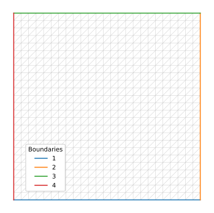
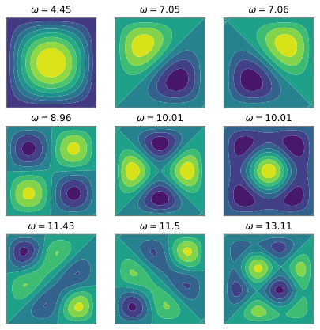

# Eigenvalues of the Helmholtz equation

We want to find the eigenvalues *ω*<sup>2</sup> and eigenvectors *h* of the Helmholtz equation:


with, say, *h*=0 on the boundaries.

## Mesh

Let us first build a mesh (complete example [here](../examples/Helmholtz/Helmholtz.py)):

```python
import pyFreeFem as pyff

nbPts = 25

script = pyff.InputScript( nbPts = nbPts )
script += pyff.edpScript('mesh Th = square( nbPts, nbPts );')
script += pyff.OutputScript( Th = 'mesh' )
```
To plot the mesh, we just need to run the FreeFem code and catch its output:

```python
from pylab import *

ff_out = script.get_output()
Th = ff_out['Th']

Th.plot_triangles(color = 'k', lw = .5, alpha = .2 )
Th.plot_boundaries()
legend()
```
Here is what we get:



## Finite element matrices

We now create three finite-element matrices with FreeFem.

The stiffness matrix corresponds to the Laplacian term of the Helmholtz equation, and the Gramian matrix to the second term. We'll use the boundary Gramian matrix to enforce the boundary condition.

These matrices depend on the finite element space. For simplicity, we content ourselves with a P1 space:

```python
script += pyff.edpScript('fespace Vh( Th, P1 );')

script += pyff.VarfScript(
    stiffness = 'int2d(Th)( dx(u)*dx(v) +  dy(u)*dy(v) )',
    Gramian = 'int2d(Th)( u*v )',
    BoundaryGramian = 'int1d(Th, 1, 2, 3, 4 )( u*v )'
    )

ff_out = script.get_output()
```
We translate the Dirichlet boundary condition into a mixed one, namely


where ε is a very small real number. Then, the weak formulation of the Helmholtz equation reads


where *S*, *G* and *G<sub>b</sub>* are the stiffness, Gramian and boundary Gramian matrices.

## Eigenvalue problem

Our finite element matrices are sparse matrices. To solve the eigenvalue problem, we call the `eigs` method of the `scipy.sparse.linalg` library.

Let's say we want 9 eigenvalues, close to *ω*<sup>2</sup> ~ 1.

```python
from scipy.sparse.linalg import eigs

epsilon = 1e-6

eigenvalues, eigenvectors = eigs( ff_out['stiffness'] - 1/epsilon*ff_out['BoundaryGramian'], 9, ff_out['Gramian'], sigma = 1 )

print(eigenvalues)
```
We're done:

```console
>>> [ 19.81727107+0.j  49.68331028+0.j  49.87208571+0.j  80.199186  +0.j
 100.23286517+0.j 100.24694401+0.j 130.63358598+0.j 132.2471015 +0.j
 171.94158044+0.j]
```
## Plot the eigenvectors

We just need to loop over the eigenvalues:

```python
fig, axs = subplots( nrows = 3, ncols = 3 )
axs = axs.flatten()

for i, eigenvalue in enumerate( eigenvalues ) :

    omega = sqrt( real( eigenvalue ) )

    ax = axs[i]
    ax.tricontourf( Th, real( eigenvectors[:,i] ) )
    ax.set_title(r'$\omega=$' + str( round( omega, 2 ) ) )
```

The eigenvectors look like this:


