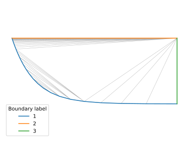
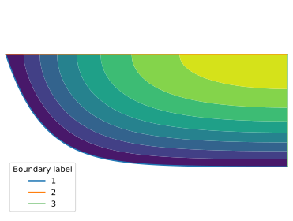
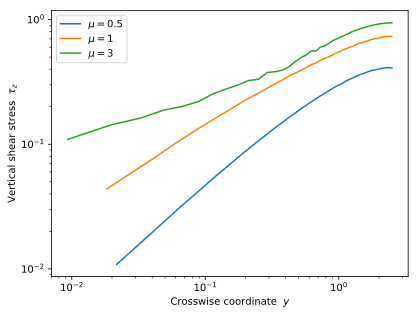

# Poisson equation in a wedge

We want to compute the velocity of a viscous flow in a sharp-cornered channel, and plot the shear stress it excerts on the channel's bottom.

## Mesh

We first build a mesh with a sharp angle:

```Python
W = 5 # width of the canal
mu = 3 # tangent of the wedge angle

x = array( [0] + list( logspace( -4, log10( W/2 ), 50 ) ) )
y = exp( -mu*x ) + exp( mu*( x - W ) ) - 1.

x = list(x) + [W/2]
y = list(y) + [0]

Th = pyff.TriMesh(x,y)
Th.add_boundary_edges( range(len(x)-1) ) # bottom
Th.add_boundary_edges( [ len(x)-1, 0 ] ) # free surface
Th.add_boundary_edges( [ len(x)-2, len(x)-1 ] ) # symmetry axis
```
At this point, the mesh is rather ugly:


## Finite elements

We now send this mesh to FreeFem++, and solve the Poisson problem:
```Python
script = pyff.InputScript( Th = Th, err = err )
script += '''
fespace Vh( Th, P2 );
fespace Vhd( Th, P1 );

Vh u, ut;
Vhd tauz, uOutput;

problem Poisson( u, ut ) =
    int2d(Th)( dx(u)*dx(ut) + dy(u)*dy(ut) )
    - int2d(Th)( ut )
    + on( 1, u = 0 );

Poisson;

for( int i; i < 4; i++ )
{
    Th = adaptmesh( Th, u, err = err, iso = 1 );
    Poisson;
}

uOutput = u;
tauz = dy(u);

'''
script += pyff.OutputScript( uOutput = 'vector', tauz = 'vector', Th = 'mesh' )
```
## Ouput
We're now ready to launch the simulation and read the output:
```Python
ff_output = script.get_output()
Th = ff_output['Th']
u = ff_output['uOutput']
```
The velocity field looks like so (the mesh has been refined by FreeFem++):


## Shear stress
Finally, we can plot the shear stress on the boundary:
```python
tau_z = ff_output['tauz']

boundary_label = 1
boundary_segments = Th.get_boundaries()[boundary_label]

for nodes in  boundary_segments  :
    plot( Th.x[nodes][1:], tau_z[nodes][1:], label = r'$\mu=$' + str(mu) )
```
We find that its assymptotic behavior near the corner of the wedge depends on the latter's opening angle :

