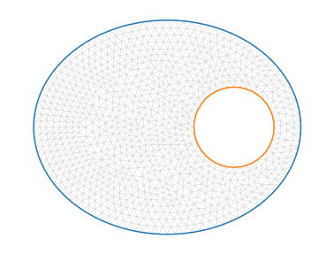
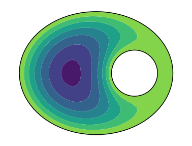

# PyFreeFem documentation

## Basic examples

### Finite element matrices

To get finite element matrices, we first need to create a mesh, and define a finite element space. The VarfBlock function then creates, and exports, the matrix corresponding to a variational formulation:

```python
import pyFreeFem as pyff

script = pyff.edpScript('''
border Circle( t = 0, 2*pi ){ x = cos(t); y = sin(t); }
mesh Th = buildmesh( Circle(20) );
fespace Vh( Th, P1 );
Vh u,v;
''' )

# Create and export stiffness matrix
script += pyff.VarfScript( stiffness = 'int2d(Th)( dx(u)*dx(v) +  dy(u)*dy(v) )')
stiffness = script.get_output()['stiffness']
print(stiffness)
```

```console
>>> (0, 0)	1.72789742056
>>> (0, 1)	-0.422931342447
>>> (0, 8)	-0.331359535237
>>> (0, 9)	-0.973606542874
...
```

### Solve Poisson's equation

We first create a mesh, and import the associated matrices.

```python
import pyFreeFem as pyff
import matplotlib.pyplot as pp

script = pyff.edpScript('''
real smallRadius = .3;
border outerCircle( t = 0, 2*pi ){ x = cos(t); y = 0.8*sin(t); }
border innerCircle( t = 2*pi, 0 ){ x = .5 + smallRadius*cos(t); y = smallRadius*sin(t); }
mesh Th = buildmesh( outerCircle(100) + innerCircle(40) );

fespace Vh( Th, P1 );
Vh u,v;
''')

script += pyff.OutputScript( Th = 'mesh' )

script += pyff.VarfScript(
    stiffness = 'int2d(Th)( dx(u)*dx(v) +  dy(u)*dy(v) )',
    Gramian = 'int2d(Th)( u*v )',
    boundary_Gramian = 'int1d(Th, 1, 2)( u*v )'
    )

ff_output = script.get_output()
Th = ff_output['Th']

Th.plot_triangles( color = 'k', alpha = .2, lw = .5 )
Th.plot_boundaries()
pp.show()
```
The mesh looks like this:



We now solve Poisson's equation on this mesh, with absorbing boundary conditions on the two boundaries. We do this with spsolve from the scipy library.

```python
from scipy.sparse.linalg import spsolve
import numpy as np

epsilon = 1e-4
M = - ff_output['stiffness'] + 1./epsilon*ff_output['boundary_Gramian']
Source = ff_output['Gramian']*np.array( [1]*len( Th.x ) )
u = spsolve( M, Source )

pp.tricontourf( Th, u )
Th.plot_boundaries( color = 'black' )
pp.show()
```
Here is the result:




## More examples

- [Input and output](./IO.md) to and from FreeFem++

- [Build](./build_your_own_mesh.md) a mesh from scratch

- [Refine](./adaptmesh.md) a mesh manually

- [Compute](./rectangle_groove.md) the flow in a microfluidics groove

- [Change the mesh](./mess_with_the_mesh.md) manually

- [Solve](./Helmholtz.md) an eigenvalue problem

- [Evaluate](./boundary_values.md) a field on a boundary

- [Mix](./mixed_FE_spaces.md) finite-element spaces on the same mesh

- Evaluate the [shear stress](./shear_stress.md) of a viscous flow on a wavy bottom

- Compute [travel times](./travel_time.md) along stream lines
