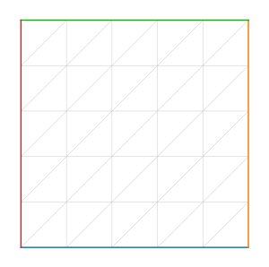
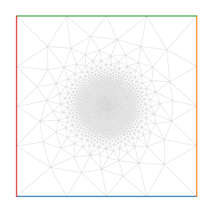

# Mesh refinement

## Initial mesh

We first create an unrefined square mesh with FreeFem++.

```python
import pyFreeFem as pyff

script = pyff.edpScript('mesh Th = square(5, 5);')
script += pyff.OutputScript( Th = 'mesh' )
Th = script.get_output()['Th']
```
This mesh looks like this:



## Refinement

We now want to refine the above mesh to accurately represent a two-dimenionnal Gaussian centered at (0.5,0.5). To to so, we use the FreeFem++ function [adaptmesh](https://doc.freefem.org/documentation/mesh-generation.html#the-command-adaptmesh). We also need to [import and export](./IO.md) data to and from FreeFem++.

```python
# create refinement script
script = pyff.InputScript( Th = 'mesh' )
script += 'fespace Vh( Th, P1 );'
script +=  pyff.InputScript( u = 'vector' )
script += 'Th = adaptmesh( Th, u, iso = 1 );'
script += pyff.OutputScript( Th = 'mesh' )

# refine Th
for _ in range(3) :
    u = exp( - ( ( Th.x - .5 )**2 + ( Th.y - .5 )**2 )/.1**2 )
    Th = script.get_output( Th = Th, u = u )['Th']
```
The refined mesh looks like this:



In fact, this refinement procedure is encapsulated into the [adapmesh](./build_your_own_mesh.md) function of pyFreeFem, which wraps the adaptmesh function of FreeFem++.
