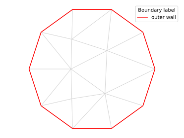
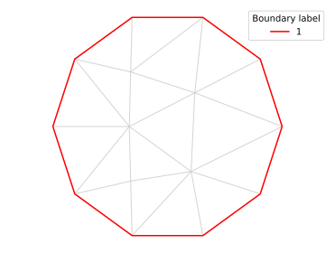

# Boundary names

## Integer label

FreeFem handles boundary referencing by integer labels. For instance:

```python
from pylab import *
import pyFreeFem as pyff

script = pyff.edpScript('''
border Circle( t = 0, 2*pi ){ x = cos(t); y = sin(t); label = 5; }
mesh Th = buildmesh( Circle(10) );
''')

script += pyff.OutputScript( Th = 'mesh' )

Th = script.get_output()['Th']
```

This produces a mesh `Th` whose boundary is labeled with the integer `5`. To plot it:

```python
Th.plot_triangles( lw = 1, color = 'LightGrey')
Th.plot_boundaries( color = 'red' )
legend( title = 'Boundary label' )
show()
```

Here is the result:


## Other types of labels

It is often convenient to name boundary more explicitly. For instance:

```python
Th.rename_boundary( { 5:'outer wall'} )
```



The problem is that Freefem cannot handle label types other than integers. Thus, if we use this mesh as an input for a new FreeFem script, pyFreeFem will rename the boundary:

```python
script = pyff.InputScript( Th = Th )
script += pyff.OutputScript( Th = 'mesh' )
Th = script.get_output()['Th']
```



## Keeping track of labels

The only way to keep a non-integer label throughout an exchange with FreeFem is to store the conversion dictionary:

```python
Th.rename_boundary( { 5:'outer wall'} )
print( Th.get_boundary_label_conversion() )
```

```console
>>> ({'outer wall': 1}, {1: 'outer wall'})
```

This is what [`adaptmesh`](./adapmesh.md) does by default.
