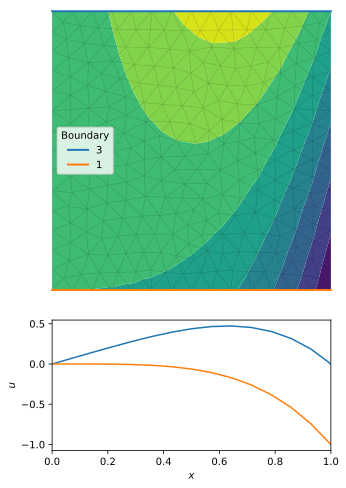

# Evaluate a field on boundaries

We first build a square mesh, and create a field `u` on it:
```python
import pyFreeFem as pyff

script = pyff.edpScript('mesh Th = square( 3, 3 );')
script += pyff.OutputScript( Th = 'mesh' )
Th = pyff.adaptmesh( script.get_output()['Th'], hmax = .05 )

u = Th.x*( Th.y - Th.x**3)
```

We then get the boundaries of the mesh `Th`:
```python
boundaries = Th.get_boundaries()

for label, segments in boundaries.items() :
  print('-----')
  print(label)
  for segment in segments :
    print(*segment)
```
This returns, for each boundary, all the segments it is made of. Here, each bondary has just one segment. Each segment is a list of node indices.
```console
Boundary 1
0 3 5 9 14 22 32 45 62 83 104 123 142 161 181
Boundary 2
181 200 201 203 219 218 224 235 244 246 253 254 259 263 266
Boundary 3
266 265 262 257 250 239 227 213 193 172 151 130 110 88 67
Boundary 4
67 50 53 55 54 37 36 35 29 21 13 8 4 1 0
```
We can now plot the mesh and the field `u`:
```python
figure()
ax = gca()
ax.tricontourf( Th, u )
Th.plot_triangles( ax = ax, color = 'k', lw = .5, alpha = .2 )
```
Finally, we plot the value of `u` the two horizontal boundaries:
```python
figure()
ax_boundary = gca()

for boundary_label in 3, 1 :
    boundary = boundaries[boundary_label][0]
    color = ax.plot( Th.x[boundary], Th.y[boundary], clip_on = False, label = boundary_label )[0].get_color()
    ax_boundary.plot( Th.x[boundary], u[boundary], color = color, label = boundary_label )
```
Below is the result:


