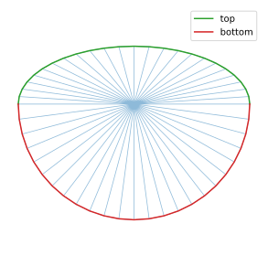
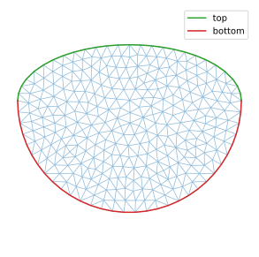

# Build a mesh from scratch

## Initial mesh

We first create a mesh without calling FreeFem++, by joining a top boundary to a bottom one. We then make all triangles join at the origin.

```python
import pyFreeFem as pyff

theta =  linspace( 0, pi, 25 )
top = cos(theta), 0.5*sin(theta)

theta =  linspace( -pi, 0, len(theta) )[1:-1]
bottom = cos(theta), sin(theta)

x = list( top[0] ) + list( bottom[0] ) + [0]
y = list( top[1] ) + list( bottom[1] ) + [0]

triangles = [ [ i, i + 1, len(x) - 1 ] for i in range( len(x) - 2 ) ]
triangles += [ [ len(x) - 2, 0, len(x) - 1 ] ]

Th = pyff.TriMesh( x, y, triangles )
Th.add_boundary_edges( range( len( top[0] ) ), 'top' )
Th.add_boundary_edges( list( range( len( top[0] ) - 1, len( x ) - 1 ) ) + [0], 'bottom' )
```
This mesh looks like this:



## Refinement

We now want to refine the above mesh. To to so, we use the adapmesh function of pyFreeFem, which is the adaptmesh function of FreeFem++ in disguise. It takes the same arguments.

```python
Th = pyff.adaptmesh( Th, hmax = .1, iso = 1 )
```
The new mesh looks like this:


