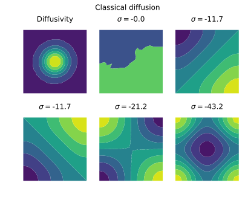
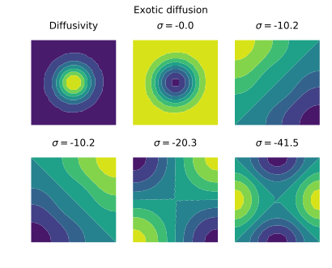

# Compare diffusion models

We want to compare the two following models for heterogeneous diffusion:

- The classical model: $\partial_t \rho = \partial_k \left( D \partial_k \rho \right)$

- The exotic model: $\partial_t \rho = \partial_{kk} \left( D \rho \right)$

To do so, following the advice of S. Djambov, we will compare the eigenvalue spectrum of the two models. The complete code is [here](../examples/diffusion_equation/diffusion_equation.py).

## Imports

```python
from pylab import *
import pyFreeFem as pyff
from scipy.sparse.linalg import eigs
```

The last line is for solving the eigenvalue proglem.

## Mesh

A simple square mesh:

```python
script = pyff.edpScript('mesh Th = square( 15, 15 );')
script += pyff.OutputScript( Th = 'mesh' )
Th = script.get_output()['Th']

Th.x -= .5
Th.y -= .5
```

The last two lines are just to center the mesh in (0,0).

## Define finite-elements matrices

Import mesh, create finite element space, and import diffusivity.

```python
script = pyff.InputScript( Th = 'mesh' )

script += '''
fespace Vh( Th, P1 );
Vh u, v;
'''

script += pyff.InputScript( D = 'vector' )
```

We can now write the weak formulation of the problem, and define the corresponding matrices:

```python

script += pyff.VarfScript(
    Gramian = 'int2d(Th)( u*v )',
    stiffness_classical = 'int2d(Th)( dx(u)*D*dx(v) +  dy(u)*D*dy(v) )',
    stiffness_exotic = 'int2d(Th)( dx(u)*D*dx(v) +  dy(u)*D*dy(v) + dx(D)*u*dx(v) +  dy(D)*u*dy(v) )',
    )
```

## Define diffusivity field

A Gaussian diffusivity:

```python
l = .2
D = 1 + exp( -( Th.x**2 + Th.y**2 )/l**2 )
```

## Solve the eigenvalue problem

We solve and plot for the two cases:

```python
for diffusion_type in ('classical','exotic') :

    fig, axs = subplots( 2, 3 )
    fig.suptitle( diffusion_type.capitalize() + ' diffusion' )
    axs = axs.flatten()

    axs[0].tricontourf( Th, D )
    axs[0].set_title('Diffusivity')

    # get FE matrices

    M = script.get_output( Th = Th, D = D )

    # solve eigenvalue problem

    eigenvalues, eigenvectors = eigs( M['stiffness_' + diffusion_type], 9, M['Gramian'], sigma = 1 )

    for i in range( len(axs) - 1 ) :
        axs[i+1].tricontourf( Th, real( eigenvectors[:,i] ) )
        axs[i+1].set_title( r'$\sigma=$' + str(-round(real(eigenvalues[i]),1)))
```

Here are the resulting plots:



