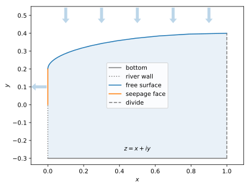
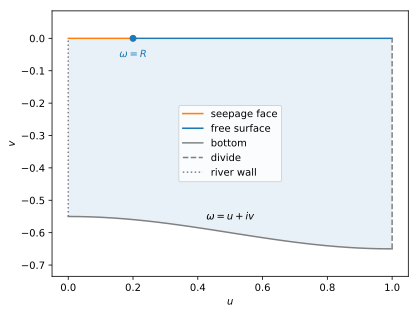
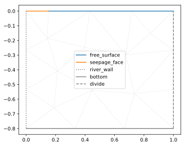
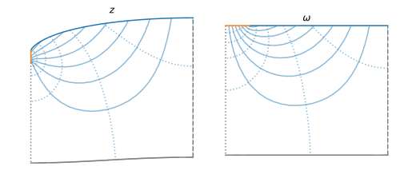

# Steady flow in a free-surface aquifer

We want to compute the two-dimensional Darcy flow in an unconfined aquifer. The problem features a free boundary, where both the pressure and the stream function are known, but the location of which is unknown a priori.

A laboratory example of such a flow can be found here:

[Flow and residence time in a two-dimensional aquifer recharged by rainfall](https://hal.archives-ouvertes.fr/hal-03207646/document), V. Jules, E. Lajeunesse, O. Devauchelle, A. Guérin, C. Jaupart, P.-Y. Lagrée, *Journal of Fluid Mechanics*, 917, A13, 2021.

A similar problem is presented in the [FreeFem++ documentation](https://doc.freefem.org/models/free-boundary-problems.html), where a time-dependent Darcy flow with a free surface is solved. This time-evolution numerical scheme, however, gets unstable as it approaches the steady state.

We propose here an alternative based on conformal mapping. A preliminary version of this method can be found here:

[Flow in a thick and unconfined aquifer recharged by rainfall](https://u-paris.fr/theses/detail-dune-these/?id_these=4682) (in French), V. Jules,
*Thèse de doctorat en Sciences de la terre et de l'environnement*,
ED 560 Sciences de la terre et de l'environnement et physique de l'univers, Université Paris Cité, Paris, 2020.

## Equations and boundary conditions

We want to solve the Laplace equation for the pressure head $\phi$ in a two-dimensional aquifer, that is:

$$
\nabla^2 \phi = 0
$$

under the water table. We define the analytical function $\Phi=\phi + i \psi$, where $\psi$ is the stream function associated to this Darcy flow.

The boundary conditions are (figure below):

- On the bottom, $y = -H$ and $\psi=0$
- On the divide, $x = 1$ and $\psi=0$
- On the river wall (below the river, $y<0$), $x=0$ and $\psi=0$
- On the seepage face (above the river, $y>0$), $x=0$ and $\phi=y$
- On the free surface (the water table), $\phi = y$ and $\psi = R( 1 - x )$

where $R$ is the recharge (rainfall) rate.



## Conformal mapping

We define the Zhukovsky map $f$:

$$
\omega = z - i \phi
$$

The figure below shows our aquifer in the mapped space. The boundary conditions remain unchanged. We will solve the Laplace equation in this mathematical space.



There is still a free boundary in this problem: the bottom's location is unknown in the mathematical plane. This, however, is still progress, because this free boundary is far from the outlet's singularity, and because it turns into a horizontal line when the rainfall rate vanishes ($R=0$).

## Linearized problem

When the rainfal rate $R$ is small enough, our problem can be linearized. In the mathematical space, this translates into the bottom line remaining at $\mathrm{Im} \omega = - H$. In other words, we let the bottom lie where it is when $R=0$.

This approximation fixes the free boundary; it is therefore straightforward to solve it with finite elements. It will also prove the basis for a better approximation of the solution.

The complete code for this problem is [here](../examples/free-surface_aquifer/linearized_problem.py).

### Build the mesh

There are of course many ways to build the mesh. Here's an option that favors clarity over terseness. We first define and name the points we need:

```python
from pylab import *

R = 0.15
H = .8

points = dict(
    seepage_bottom = ( 0, 0 ),
    seepage_top = ( R, 0 ),
    divide_top = ( 1, 0 ),
    divide_bottom = ( 1, -H  ),
    river_bottom = ( 0, -H )
    )
```

We then name the boundaries that link these points:

```python
boundaries = dict(
    free_surface = [ 'divide_top', 'seepage_top' ],
    seepage_face = [ 'seepage_top', 'seepage_bottom' ],
    river_wall = [ 'seepage_bottom', 'river_bottom' ],
    bottom = [ 'river_bottom', 'divide_bottom' ],
    divide = [ 'divide_bottom', 'divide_top' ]
    )
```
We then build the mesh, provide it with boundaries, and refine it for prettiness:

```python
import pyFreeFem as pyff


Th = pyff.TriMesh( *array( list( points.values() ) ).T )

for boundary_name, boundary_points in boundaries.items() :
    Th.add_boundary_edges( [ list( points.keys() ).index( point ) for point in boundary_points ], boundary_name )

Th = pyff.adaptmesh( Th, 1, iso = 1, hmax = .3 )
```

Here's how the resulting mesh looks like:

```python
Th.plot_triangles( ax = ax_mesh )
Th.plot_boundaries()
legend()
```


When creating this mesh, we've assumed that the aquifer's bottom is flat in the mathematical space; as a result, it will not be flat in the physical space.

### Get the finite-elements matrices

To solve the Laplace equation on this mesh, we will need the stiffness matrix, which corresponds to

$$
\iint_{\Omega} \partial_i u \partial_i v
$$

and the Gramian matrix for each boundary, that is:

$$
\int_{\mathrm{boundary}} u v
$$

To get these matrices, we define a pyFreeFem script with the mesh as an input:

```python
script = pyff.InputScript( Th = 'mesh' )
script += pyff.edpScript('fespace Vh( Th, P1 );')

FE_matrices = dict( stiffness = 'int2d(Th)( dx(u)*dx(v) +  dy(u)*dy(v) )' )

boundary_name_to_int = Th.get_boundary_label_conversion()[0]

for boundary_name in Th.get_boundaries().keys() :
    FE_matrices[ boundary_name ] = 'int1d(Th,' + str( boundary_name_to_int[ boundary_name ] ) + ')( u*v )'

script += pyff.VarfScript( **FE_matrices )

FE_matrices = script.get_output( Th = Th )
```

### Write and solve the problem

We now need to find the physical coordinate $z=x+iy$ as a function of the mathematical coordinate $\omega=u+iv$. Because our mapping from $z$ to $\omega$ is conformal, both $x$ and $y$ are analytical functions. This means we need to solve the Laplace equation twice over the mathematical domain.

The boundary conditions are now expressed in terms of $x$ or $y$. On the bottom, for instance, $y = -H$. This also means that $\partial_n x=0$, by virtue of the Cauchy-Riemann equations. As usual with finite elements, we enforce the first one by requiring

$$
y + H = \epsilon \partial_n y
$$

The same reasoning applies to the remaining boundaries.

We now write the finite element problem in terms of matrices, namely $M \cdot X = B$. For the $x$ coordinate, this reads

```python
from scipy.sparse.linalg import spsolve

epsilon = 1e-6

M = - FE_matrices['stiffness']
B = Th.x*0

boundary_name = 'seepage_face'
M += 1/epsilon*FE_matrices[boundary_name]

boundary_name = 'river_wall'
M += 1/epsilon*FE_matrices[boundary_name]

boundary_name = 'divide'
M += 1/epsilon*FE_matrices[boundary_name]
B += 1/epsilon*FE_matrices[boundary_name]*( Th.x*0 + 1 )

boundary_name = 'bottom' # x = u
M += 1/epsilon*FE_matrices[boundary_name]
B += 1/epsilon*FE_matrices[boundary_name]*( Th.x )

boundary_name = 'free_surface'
M += 1/epsilon*FE_matrices[boundary_name]
B += 1/epsilon*FE_matrices[boundary_name]*( Th.x - R )/( 1 - R )

x = spsolve( M, B )
```
The resulting vector, `x`, is the solution to our problem.

In the above expression, we need to remember that `Th.x` is the horizontal coordinate in the mathematical space, namely $u$ (and not $x$). This unfortunate notation cannot be avoided, since `Th.x` refers to the attribute `x` of the triangulation object that underlies the mesh `Th`. This convention is consistent with that used in FreeFem++.

Similarly, for `y`:

```python
M = - FE_matrices['stiffness']
B = Th.x*0

boundary_name = 'bottom' # dy/dn = 1
B += FE_matrices[boundary_name]*( Th.x*0 + 1 )

boundary_name = 'free_surface'
B += -FE_matrices[boundary_name]*( Th.x*0 + 1 )/( 1 - R )

y = spsolve( M, B )
```

We have now solved our problem, but on a very crude mesh. To refine the mesh, we simply need to ad the following lines before we create the finite-element matrices, and repeat the solution procedure until the desired precision is reached:

```python
try :
    Th = pyff.adaptmesh( Th, ( x - Th.x )*( y - Th.y ), hmax = H/15, iso = 1, err = 1e-2 )
except :
    pass
```
With this, we refine the mesh with respect to $(x-u)(y-v)$.

### Back to physical space

To plot our result in the physical space, we need to create a mesh that shares its connectivity with `Th`, only with its nodes at their physical location.

We do this by creating a deep copy of the original mesh, and then assign the solutions to the Laplace equations, `x` and `y`, to its nodes.

```python
from copy import deepcopy

Th = dict( omega = Th, z = deepcopy(Th) )

Th['z'].x = x
Th['z'].y = y
```

The fields we would like to plot are the real and imaginary parts of $\Phi$, the head field. To get it, it is convenient to use complex numbers:

```python
omega = Th['omega'].x + 1j*Th['omega'].y
z = Th['z'].x + 1j*Th['z'].y

Phi = 1j*( omega - z )
```

We can finally plot $Phi$ in the physical and mathematical planes:

```python
fig, ax = subplots( ncols = 2, figsize = (8,5) )

ax = dict( zip( list( Th.keys() ), ax ) )

for space in Th.keys() :
    ax[space].tricontour( Th[space], real(Phi), **st.flow['iso_head'] )
    ax[space].tricontour( Th[space], imag(Phi), **st.flow['flow_lines'] )
    Th[space].plot_boundaries( ax = ax[space] )
    ax[space].axis('scaled')

ax['omega'].legend()
```


A minor issue with this method is that the elevation of the origin of the physical mesh is arbitrary. To solve this issue, we simply remove to the mesh's vertical coordinate the elevation of the highest point on the river wall:

```python
Th['z'].y -= max( Th['z'].y[ Th['z'].get_boundaries()['river_wall'][0] ] )
```
As expected, the bottom is not flat in the physical space. It gets flatter, however, as the rainfall rate $R$ approaches zero.

To get a better approximation of the flow, we need to relax the small-rainfall approximation that allowed us to linearize the problem, and return to the original problem.

## Relaxation to the non-linear solution

We now return to the orginal problem, for which the location of the bottom in the mathematical plane is unknown.

We propose the following relaxation method:

- Solve the linear problem
- Note that the conformal map is almost the identity near the river_bottom
- Deform the mesh in the mathematical plane so that its bottom moves by an amount opposed to the error in the physical plane, that is, $y-H$
- Repeat and hope for convergence.

The complete code for this problem is [here](../examples/free-surface_aquifer/non-linear_problem.py).

### Error field

We want to deform the mesh in a smooth way. To do so, we can create a field $\delta y$ that satisfy the Laplace equation, with the following condition on the bottom:

$$
\delta y = y + H
$$

On the two sides, we can require, for instance, that $\partial \delta y = \delta y$. On the free surface, we need $\delta y$ to vanish.
