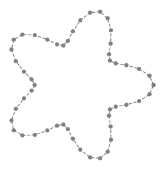
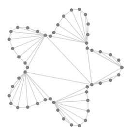
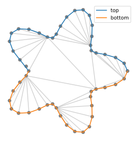

# Create a mesh based on its boundary

## Polygon

We first create a simple, but non-convex, polygon:

```python
from pylab import *

theta = linspace(0,2*pi,51)
r = 1 + .3*cos(5*theta)
x = r*cos(theta)
y = r*sin(theta)

plot(x,y,'o', color = 'grey')
```



We now want to create a mesh in this polygon, which we treat as an oriented boundary. For this we call the `TriMesh_from_polygon` function, which is but a wrapper for the [`polygon_triangulate`](https://people.sc.fsu.edu/~jburkardt/py_src/polygon_triangulate/polygon_triangulate.html) function by J. Burkardt.

```python
Th = pyff.TriMesh_from_polygon( array( [ x, y ] ).T )
Th.plot_triangles( color = 'lightgrey' )
```



## List of boundaries

Often, the polygon that bounds the mesh is a list of boundaries with distinct labels. For instance:

```python
labels = 'top', 'bottom'
i_cut = int( len(theta)/2 )
points = array([x,y]).T
boundaries = [ points[:i_cut], points[i_cut:]  ]
```
To keep track of these labels, we now call the `TriMesh_from_boundaries` function:

```python
Th = pyff.TriMesh_from_boundaries( boundaries, labels )
```

We may then show the boundaries on the plot:

```python
Th.plot_boundaries()
legend()
```


