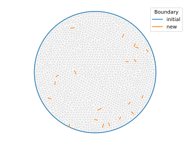
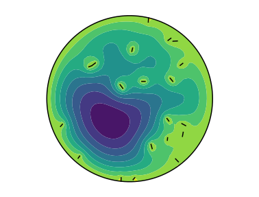

# Mess with the mesh

Here, we create a mesh with FreeFem++, import it as a TriMesh, change its boundaries and export it back to FreeFem++. [Exports and imports](./IO.md) to and from FreeFem++ are just what pyFreeFem was written for. The complete code is [here](../examples/mesh_IO.py).

We first build a mesh with FreeFem:
```python
import pyFreeFem as pyff

# Create mesh with FreeFem++
script = pyff.edpScript( '''
    border Circle( t = 0, 2*pi ){ x = cos(t); y = sin(t); }
    mesh Th = buildmesh( Circle(150) );
    ''' )
script += pyff.OutputScript( Th = 'mesh' )
Th = script.get_output()['Th']
```

We now pick a few edges at random, and call them boundaries:


```python
from pylab import choice

for triangle_index in choice( range( len( Th.triangles ) ), 6 ) :
    Th.boundary_edges.update( { ( triangle_index, 0 ) : 2 } )

Th.rename_boundary( {1:'initial', 2:'new'} )
```
The mesh looks like this:



We want to solve the Poisson equation on this new mesh. Let us first calculate the finite-elements matrices we need.

```python
# Export mesh back to FreeFem
script = pyff.InputScript( Th = Th )

# calculate FEM matrices
script += '''
    fespace Vh( Th, P1 ) ;
    Vh u, v ;
    '''

matrices = {
    'stiffness' : 'int2d(Th)( dx(u)*dx(v) +  dy(u)*dy(v) )',
    'Gramian' : 'int2d(Th)( u*v )',
    'boundary_Gramian' : 'int1d(Th, 1, 2)( u*v )'
    }

script += pyff.VarfScript( **matrices )
matrices = script.get_output()
```
We may now [solve](./README.md) our finite-element problem. Here is the result:



A more useful mesh change, perhaps, is to [refine it](./adaptmesh.md).
