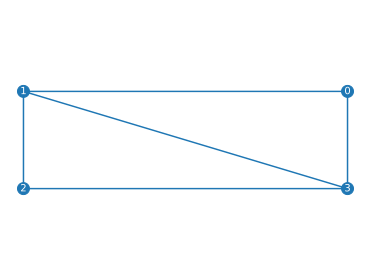
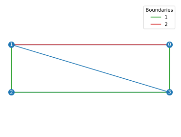
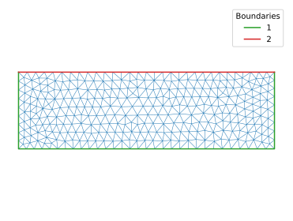
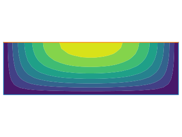

# Flow in a rectangle microfluidics groove

## Poisson equation

We compute the velocity of a laminar flow in a rectangular, free-surface channel. The (dimensionless) velocity field *u* satisfies the two-dimensional Poisson equation:


with *u*=0 on the bottom and on the sides, and


at the surface.

## Build the mesh

We first need to build a rectangular mesh. We could do this using a FreeFem++ script, like [here](./shear_stress.md). For a change, here, we design it in Python, and refine it with FreeFem++. [Here](../examples/rectangle_groove/rectangle_groove_mesh.py) is the full code.

### Initial mesh

We first choose the rectangle's dimensions, and defines its four corners:

```python
from pylab import *

D = 0.3
W = 1

x = array([ .5,-.5,-.5,.5 ])*W
y = array([0,0,-1,-1])*D
```

We then define a triangular mesh that fits into our rectangle:

```python
import pyFreeFem as pyff

Th = pyff.TriMesh( x, y )

Th.plot_triangles()
Th.plot_nodes( labels = 'index' )
```

The result is:



### Boundaries

At this point, the mesh `Th` has no boundaries. To define them, we only need to provide the list of the nodes that lie on a specific boundary. Here, a solid boundary is labelled with '1', whereas the free surface is labelled with '2'.

``` Python
Th.add_boundary_edges( [1,2,3,0] )
Th.add_boundary_edges( [0,1] )

Th.plot_boundaries()
legend()
```
The mesh now has labelled boundaries:



### Mesh refinement

Finally, we refine our mesh with the `adaptmesh` function of FreeFem++:

``` Python
Th = pyff.adaptmesh(Th, hmax = .03, iso = 1)
```
The mesh now looks like so:



## Solve the Poisson equation

To approximate the velocity field, we use finite elements and FreeFem++. One way to to this would be to import the build the stiffness matrix with FreeFem++, and to invert it with python, like [here](./README.md). This, however, is unnecessary if we solve the problem only once, and are only interested in the result.

Here, instead, we solve the entire problem with FreeFem++, and import the results with pyFreeFem.

### Export the mesh to FreeFem++

We first write an `edpScript` object that uses our mesh:

``` Python
script = pyff.InputScript( Th = Th )

print(script.get_edp())
```
This translates into FreeFem++ language as

``` cpp
mesh Th;
Th = readmesh( "/tmp/tmpf0z7l38w.msh" ) ;
```
So far, we haven't run FreeFem++.

### Solve the finite-elements problem

We simply use a standard FreeFem++ script to do so. [This one](https://doc.freefem.org/tutorials/membrane.html), for instance---or a slightly adapted version of it. We just need to add it to our script:

``` Python
script += '''
// Fespace
fespace Vh(Th, P1); //P2 conforming triangular FEM
Vh phi, w;

// Solve
solve Poisson(phi, w)
    = int2d(Th)(
          dx(phi)*dx(w)
        + dy(phi)*dy(w)
    )
    - int2d(Th)(
          w
    )
    + on(1, phi=0)
    ;
'''
```
Once run in FreeFem++, this script will yield a P1 approximation of the velocity field, inconveniently named `phi` here.

### Export the solution to Python

A last line will allow us to use the result of the FreeFem++ computation. PyFreefem can't guess the type of data we want to export, so we need to [specify](./IO.md) it.

``` Python
script += pyff.OutputScript( phi = 'vector' )
```

We now only need to run FreeFem++ and plot the result:

```Python
u = script.get_output()['phi']

tricontourf(Th,u)
```
This is what we finally get:


