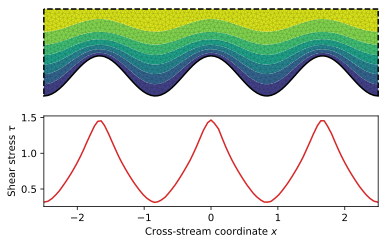

# Shear stress on a wavy bottom

We want to evaluate the shear stress a laminar viscous flow excerts on a wave bottom. To do so,
we first need to slove Poisson's equation for the flow velocity $u$:

$$\nabla^2 u = -1$$

The shear stress $\tau$ is then the gradient of $u$, which we need to evaluate on the bottom.

## Mesh

We first need to build the mesh. Our parameters are:
```python
import pyFreeFem as pyff
from pylab import *

width = 5.
height = 1.
amplitude = .3
k = 3*2*pi/width
npts = 10
```
We then use FreeFem++ to create the mesh:
```python
script = pyff.InputScript( width = width, height = height, amplitude = amplitude, k = k, npts = npts )
script += pyff.edpScript('''
border top( t = width/2, -width/2 ){ x = t; y = height; }
border bottom( t = -width/2, width/2 ){ x = t; y = amplitude*cos( k*t ); }
border left( t = height,  amplitude*cos( -k*width/2 ) ){ x = -width/2; y = t; }
border right( t = amplitude*cos( k*width/2 ), height ){ x = width/2; y = t; }
mesh Th = buildmesh( top(npts) + bottom(10*npts) + left(npts) + right(npts) );
''')

script += pyff.OutputScript( Th = 'mesh' )
Th = script.get_output()['Th']
Th = pyff.adaptmesh( Th, hmax = height/15 )
```
## Poisson's equation

We define two finite-element spaces. The flow velocity `u` will belong to the P2 space, but its derivatives, and therefore the shear stress `tau`, will belong to the P1 space.
```python
script = pyff.InputScript( Th = Th )

script += '''
fespace Vh1( Th, P1 );
fespace Vh2( Th, P2 );
'''
```
We first need the classical finite-element matrices on the P2 space
```python
script += pyff.VarfScript( fespaces = ( 'Vh2', 'Vh2' ),
    stiffness = 'int2d(Th)( dx(u)*dx(v) +  dy(u)*dy(v) )',
    Gramian = 'int2d(Th)( u*v )',
    bottom_Gramian = 'int1d( Th, 2 )( u*v )'
    )
```
To calculate `tau`, we will also need the matrices that allow us to derive `u`. They [mix the two spaces](./mixed_FE_spaces.md) `Vh1` and `Vh2`.

```python
script += pyff.VarfScript( fespaces = ( 'Vh1', 'Vh1' ),
        Gramian_P1 = 'int2d(Th)( u*v )'
        )

script += pyff.VarfScript( fespaces = ( 'Vh2', 'Vh1' ),
        Dx = 'int2d(Th)( v*dx(u) )',
        Dy = 'int2d(Th)( v*dy(u) )',
        )

M = script.get_output()
```
Now, we can solve Poisson's equation:
```python
epsilon = 1e-6
Poisson = - M['stiffness'] + 1./epsilon*M['bottom_Gramian']
Poisson_source = M['Gramian']*np.array( [-1]*shape( M['Gramian'] )[0] )
u = spsolve( Poisson, Poisson_source )
```
Finally, we can compute the shaer stress `tau`:
```python
dx_u = spsolve( M['Gramian_P1'], M['Dx']*u )
dy_u = spsolve( M['Gramian_P1'], M['Dy']*u )
tau = sqrt( dx_u**2 + dy_u**2 )
```
## Evaluate the shear stress on the bottom

We only need to [get the node indices](./boundary_values.md) that correspond to the bottom boundary:
```python
bottom_label = 2
boundary_segments = Th.get_boundaries()[bottom_label]
```
We can now evaluate the shear stress, and plot it:
```python
for nodes in  boundary_segments  :
    plot( Th.x[nodes ], tau[nodes] )
```
Here is the result (colors show flow velocity):


