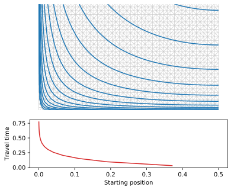
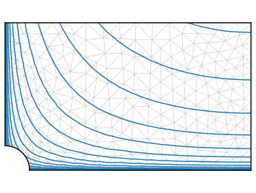
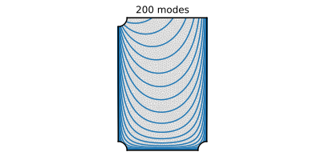
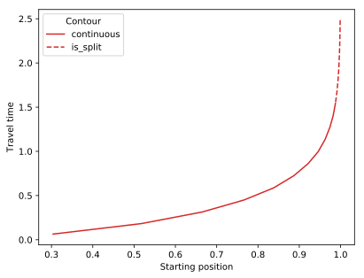

# Travel time along a streamline

Here we calculate numerically the travel time along analytic streamlines past a corner. The streamlines first correspond to the complex hyperbolic cosine, and a more complicated example follows.

## Naive method

We first build a regular, rectangular mesh on which we evaluate the streamlines:

```python
from pylab import *
import matplotlib.tri as tri

################# PARAMETERS
L = 1.
H = .3
k = pi/L
levels = logspace( -3, 0, 15 )

def Phi(z) :
    return -cosh( k*( 1j*z - H ) )

################ MESH
x = linspace( 0, L/2., 50 )
y = linspace( -H, 0, int( len(x)/max(x)*H ) )
x, y = meshgrid( x, y )
x = x.flatten(); y = y.flatten()
z = x + 1j*y

Th = tri.Triangulation( x, y )
```
We then extract the contours of the stream function, and plot them at the same time:
```python
contours = ax.tricontour( Th, imag( Phi(z) ), levels = levels )
```
The mesh looks like this:



The problem, of course, is the singularity at the lower left corner. Notwithstanding, we calculate the travel time for each contour:
```python
x_start = []
t = []

for contour in contours.collections:
    for path in contour.get_paths() :
        x, y = path.vertices.T
        z = x + 1j*y
        phi = real( Phi(z) )
        ds = sqrt( diff(x)**2 + diff(y)**2 )
        dt = ds**2/diff(phi)
        x_start += [ x[0] ]
        t += [ sum(dt) ]
```
As expected, the travel time diverges near the singularity; it is a stagnation point.

## Take the stagnation point off

We now use pyFreeFem to build a mesh that skirts the stagnation point:
```python
script = pyff.InputScript( L = L, H = H, epsilon = epsilon, npts = npts )
script +='''
border top( t = L/2., 0 ){ x = t; y = 0; }
border left( t = 0, -(H -epsilon) ){ x = 0; y = t; }
border skirt( t = pi/2, 0 ){ x = epsilon*cos(t); y = -H + epsilon*sin(t); }
border bottom( t = epsilon, L/2. ){x = t; y = -H; }
border right( t = -H, 0 ){ x = L/2; y = t; }
mesh Th = buildmesh( top(npts) + left(npts) + skirt(npts) + bottom(npts) + right(npts) );
'''
script += pyff.OutputScript( Th = 'mesh' )

Th = script.get_output()['Th']
z = Th.x + 1j*Th.y
```
Here is the mesh:



Some contours now cut through the boundary that skirts the stagnation point. To compute their travel time, we need to stitch their segments together, and add the travel time through the singularity's neighborhood.

We first define the function that gives the travel time near the stagnation point :
```python
def skirt_time( z, Phi ) :
    A = real( Phi/z**2 )
    psi = imag( Phi )
    phi_in = real( Phi )
    phi_out = real( -conj( Phi ) ) # symmetry
    return abs( ( arcsinh( phi_out/psi ) - arcsinh( phi_in/psi ) )/( 4*A ) )
```
We may now call this function when computing the travel time of split contours:
```python
z_sp = -1j*H # stagnation point

x_start = []
t = []

for contour in contours.collections:

    travel_time_path = 0
    x_start_path = []

    for path in contour.get_paths() :
        x, y = path.vertices.T
        z = x + 1j*y
        phi = real( Phi(z) )
        ds = sqrt( diff(x)**2 + diff(y)**2 )
        dt = ds**2/diff(phi)
        travel_time_path += sum(dt)
        x_start_path += [ x[0] ]

        if ( abs( z[-1] - z_sp ) - epsilon ) < epsilon :
            travel_time_path += skirt_time( z[-1] - z_sp, Phi( z[-1] ) - Phi( z_sp ) )

    x_start += [ x_start_path[0] ]
    t += [ travel_time_path ]
```
Here is the result:


## Many modes

### Large sum

To compute travel times through a closed box, we need to define the stream function as a sum of many (say 500) modes:
```python
def Phi_sum( z ) :
    Phi = 0.*z
    for n in range( 1, n_modes ) :
        Phi += 2*Phi_n( z, n )/( n*k*sinh( n*k*H ) )
    return Phi
```
That there are so many modes creates two problems:

- High-frequency modes are exponentially close to zero deep under the top surface.
- Computation time gets large (`n_modes*len(z)`)

To bypass the first problem, we make each mode explicitly vanish beyond its caracteristic depth:
```python
def Phi_n( z, n = 1 ) :
    shallow_z = imag(z) > -8./( n*k ) # deeper than this, the exponential virtually vanishes
    try : # z is an array
        Phi = z*0
        Phi[shallow_z] = -cosh( n*k*( 1j*z[shallow_z] - H ) )
        return Phi
    except : # z is a single complex number
        if shallow_z :
            return -cosh( n*k*( 1j*z - H ) )
        else :
            return 0
```
To avoid prohibitively large computations, we will use an interpolator for the stream function. To do so, we first need to build the mesh.

### Mesh

We want a rectangular mesh with singular points removed. There are three such points: two stagnation points on the bottom, and one at the outlet. We use pyFreeFem to build the mesh, and then homogeneize the triangles with `adaptmesh`:
```python
script = pyff.InputScript( L = L, H = H, epsilon = epsilon, npts = npts )
script +='''
border top( t = L, epsilon ){ x = t; y = 0; }
border outlet( t = 0, -pi/2 ){ x = epsilon*cos(t); y = epsilon*sin(t); }
border left( t = -epsilon, -( H -epsilon) ){ x = 0; y = t; }
border skirt( t = pi/2, 0 ){ x = epsilon*cos(t); y = -H + epsilon*sin(t); }
border bottom( t = epsilon, L - epsilon ){x = t; y = -H; }
border skirtRight( t = pi, pi/2 ){ x = L + epsilon*cos(t); y = -H + epsilon*sin(t); }
border right( t = -H+epsilon, 0 ){ x = L; y = t; }
mesh Th = buildmesh( top(npts) + outlet(npts) + left(npts) + skirt(npts) + bottom(npts) + skirtRight(npts) + right(npts) );
'''
script += pyff.OutputScript( Th = 'mesh' )
Th = script.get_output()['Th']

for _ in range(3):
    Th = pyff.adaptmesh( Th, iso = 1, hmax = epsilon/2, err = 5e-3 )
```
The resulting mesh looks like this:



We can now evaluate the stream function and plot the corresponding streamlines:
```python
Phi_value = Phi_sum( Th.x + 1j*Th.y )
```
This also provides us with the values we need to create an interpolator for the stream function.

### Interpolation

To avoid the repeated computation of large sums, we approximate the stream fucntion with an interpolator:
```python
phi_int, psi_int = LinearTriInterpolator( Th, real( Phi_value ) ), LinearTriInterpolator( Th, imag( Phi_value ) )

def Phi( z ) :
    x, y = real(z), imag(z)
    Phi_int = phi_int( x, y ) + 1j*psi_int( x, y )
    if is_masked(Phi_int) : # the interpolator fails
        return Phi_sum( z )
    else :
        return Phi_int
```
This function handles points that lie outside the mesh by direct call to the sum function.

### Travel time
We may now compute travel times as before:
```python
x_start = []
t = []

for contour in contours.collections[:-1]:

    travel_time_path = 0.
    x_start_path = []

    for path in contour.get_paths() :

        x, y = path.vertices.T
        z = x + 1j*y
        phi = real( Phi( z ) )
        ds = sqrt( diff(x)**2 + diff(y)**2 )
        dt = ds**2/diff(phi)
        travel_time_path += sum(dt)

        for z_sp in ( z_sp_left, z_sp_right ) :
            z_in = z[0]
            if ( abs( z_in - z_sp ) - epsilon ) < epsilon**2 :
                travel_time_path += skirt_time( z_in - z_sp, Phi( z_in ) -  Phi( z_sp ) )

    x_start += [ contour.get_paths()[-1].vertices[-1][0] ]
    t += [ travel_time_path ]
```
The following curve gets computed in a few seconds.



Of course, the longest trajectories are the ones that are more demanding in terms of mesh refinement. A better mesh would be refined along the boundaries.
