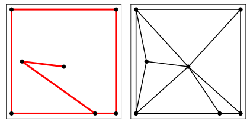
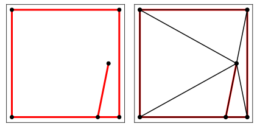
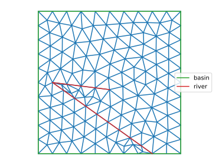

# Constrained Delaunay triangulation with the [`triangle`](https://rufat.be/triangle/index.html) library

The [`triangle`](https://rufat.be/triangle/index.html) library can handle constrained Delaunay triangulations. The triangulation it produces can be imported into pyFreeFem.

## Build a [`triangle`](https://rufat.be/triangle/index.html) triangulation

We want to triangulate a box with a river cutting through it. We can try with a regular Delaunay triangulation:

```python
import triangle as tr
from pylab import *

Ts = dict(
    vertices = [ [-1,-1], [1,-1], [1,1], [-1,1], [0.6,-1], [0.8,0] ],
    segments = [ [ 0, 4 ], [ 4, 1 ], [1, 2], [2,3], [3, 0], [4,5] ]
    )

T = tr.triangulate( Ts )

tr.compare( plt, Ts, T )
```

By default, the `tr.triangulate` function does not take the segments into account:



To take them into account, we need to add the keyword `'pa'`:

```python
T = tr.triangulate( Ts, 'pa' )
```

Indeed:




## Convert the triangulation into a `TriMesh` object

A [`triangle`](https://rufat.be/triangle/index.html) triangulation is easily imported into pyFreeFem:

```python
import pyFreeFem as pyff

Th = pyff.triangle_to_TriMesh( T )
```

However, [`triangle`](https://rufat.be/triangle/index.html) objects do not keep track of boundary handles. We thus need to add them by hand:

```python
Th.add_boundary_edges( T['segments'][:-2], 'basin' )
Th.add_boundary_edges( T['segments'][-2:], 'river' )
```

We may now refine the mesh as much as we want, and plot it:

```python
for _ in range(3):
    Th = pyff.adaptmesh( Th, hmax = .2, iso = 1 )

Th.plot_triangles()
Th.plot_boundaries()
legend()
```

