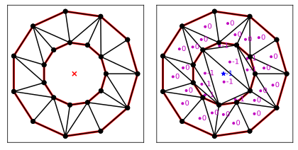
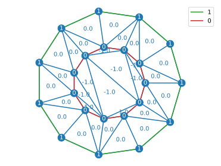

# Constrained Delaunay triangulation with the [`triangle`](https://rufat.be/triangle/index.html) library

The [`triangle`](https://rufat.be/triangle/index.html) library can handle constrained Delaunay triangulations. The triangulation it produces can be imported into pyFreeFem.

## Build a [`triangle`](https://rufat.be/triangle/index.html) triangulation

We want to triangulate a box with a river cutting through it. We can try with a regular Delaunay triangulation:

```python
import triangle as tr
from pylab import *

Ts = dict(
    vertices = [ [-1,-1], [1,-1], [1,1], [-1,1], [0.6,-1], [0.8,0] ],
    segments = [ [ 0, 4 ], [ 4, 1 ], [1, 2], [2,3], [3, 0], [4,5] ]
    )

T = tr.triangulate( Ts )

tr.compare( plt, Ts, T )
```

By default, the `tr.triangulate` function does not take the segments into account:


To take them into account, we need to add the keyword `'pa'`:

```python
T = tr.triangulate( Ts, 'pa' )
```

Indeed:


We can also attribute labels to boundary segments, so we can later distinguish their role as boundaries:

```python
Ts['segment_markers'] =  [-1]*5 + [-2]*(len(Ts['segments']) - 5 ) # label -1 for the box, and -2 for the river.
T = tr.triangulate( Ts, 'pa' )
```

## Convert the triangulation into a `TriMesh` object

A [`triangle`](https://rufat.be/triangle/index.html) triangulation is easily imported into pyFreeFem:

```python
import pyFreeFem as pyff

Th = pyff.triangle_to_TriMesh( T )
```

However, [`triangle`](https://rufat.be/triangle/index.html) objects cannot keep track of string boundary handles. We thus need to rename them by hand:

```python
Th.rename_boundary( { -1 :'box', -2:'river' } )
```

We may now refine the mesh as much as we want, and plot it:

```python
for _ in range(3):
    Th = pyff.adaptmesh( Th, hmax = .2, iso = 1 )

Th.plot_triangles()
Th.plot_boundaries()
legend()
```


## Holes and region labels

We can create a hole in a mesh, or distinguish between regions:

```python
from pylab import *
import triangle as tr

theta = linspace(0,2*pi,12)[1:]

# Big circle
vertices = array( [ cos(theta), sin(theta) ] ).T
segments = list( array( [ arange( len( vertices ) - 1 ), arange( 1, len(vertices) ) ] ).T ) + [ [ len(vertices)-1, 0 ] ]

# Small circle
vertices = list( vertices ) + list( vertices*.5 )
segments = segments + list( array( segments ) + len( segments ) )

# Hole and region
T_hole = tr.triangulate( dict( vertices = vertices, segments = segments, holes = [ [ 0, 0 ] ] ), 'pa' )
T =  tr.triangulate( dict( vertices = vertices, segments = segments, regions = [ [ 0, 0, -1, 0 ] ] ), 'pA' )

tr.compare( plt, T_hole, T ) 
```

Here is the result:



The `pyff.triangle_to_TriMesh` function keeps track of the labelling of nodes, boundary edges and vertices. The labels, which can be floats in a `triangle` object, are converted into integers in `pyFreeFem`.

```python
Th = pyff.triangle_to_TriMesh( T )

Th.plot_triangles( labels = 'label' )
Th.plot_boundaries()
Th.plot_nodes( labels = 'label', color = 'tab:blue' )
legend()
```
Here is the result:

