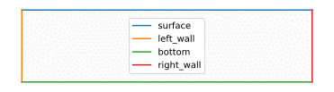
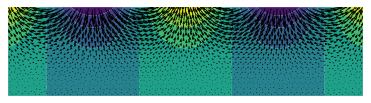
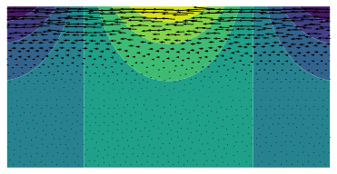

# Wave, gradient, and phase

We consider a plane gravity wave in two dimensions; $x$ is the propagation direction, and $y$ the vertical. The complex velocity potential reads

$$
\phi = e^{ikz}
$$

where $z=x+iy$.

## Mesh

We first build a rectangular mesh:

```python
L_box = 6.
H_box = 1.5

mesh_points = {}
mesh_points['surface'] = [ [L_box/2,0], [-L_box/2,0] ]
mesh_points['left_wall'] = [ mesh_points['surface'][-1], [-L_box/2,-H_box] ]
mesh_points['bottom'] = [ mesh_points['left_wall'][-1], [L_box/2,-H_box] ]
mesh_points['right_wall'] = [ mesh_points['bottom'][-1], [L_box/2,0] ]

Th = pyff.TriMesh_from_boundaries( boundaries = list( mesh_points.values() ), labels = list( mesh_points.keys() ) )
```

Before using this mesh, we refine it:

```python
for _ in range(3) :
    Th = pyff.adaptmesh( Th, iso = 1, hmax = 0.1 )
```

Here's how the mesh looks like:

```python
Th.plot_triangles( color = 'grey', alpha = .1, lw = .5 )
Th.plot_boundaries( )
legend()
```



## Wave field

We define the complex velocity potential, $\phi$, and plot its real part:

```python
k = 2

z = Th.x + 1j*Th.y
phi = exp( -1j*k*z )

fig_phi = figure()
ax_phi = gca()
ax_phi.tricontourf( Th, real(phi) )
```


## Gradients and finite-element spaces

To compute the gradient of a field, we first define the gradient matrices:

```python
M = pyff.gradient_matrices( Th )
```

`M` is a dictionnary that contains two matrices, which are not square:

```python
print( shape(M['grad_x']) )
```
```console
(2302, 1227)
```

This is because the gradient of a P1 field is naturally a P0 field. We can check this:

```python
print( len(Th.x), len(Th.triangles) )
```
```console
2302 1227
```

We can compute the gradient $\nabla \phi$:

```python
dx_phi = M['grad_x']@( phi )
dy_phi = M['grad_y']@( phi )
```

To plot this gradient, however, we need to define the space coordinates, $x$ and $y$, on the P0 space. We thus create a [projector](./mixed_FE_spaces.md):

```python
proj = pyff.get_projector( Th, 'P1', 'P0' )
print(shape(proj))
```
```console
(2302, 1227)
```
Here are our new coordinates:

```python
x_P0 = proj@Th.x
y_P0 = proj@Th.y
```

We can now use them to produce a quiver plot:

```python
quiver( x_P0, y_P0, real( dx_phi ), real( dy_phi ) )
```


## Energy flux

The energy flux associated to our wave is the imaginary part of $\phi^* \, \nabla \phi$. Let's plot this:

```python
quiver( x_P0, y_P0, imag( phi_P0.conj()*dx_phi ), imag( phi_P0.conj()*dy_phi ) )
```



As expected, the wave is propagating from right to left.
