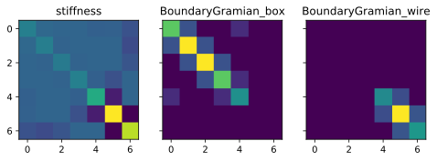
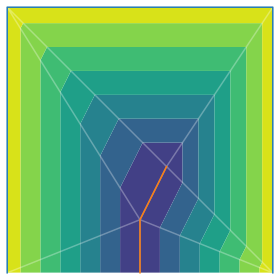
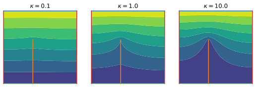
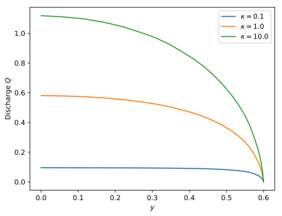

# Electric field around a resistive wire

We want to calculate the electric field around an electric wire. For this, we need to solve the Laplace equation over a domain with a one-dimensional boundary cutting into it.

## Domain and mesh

We first define a square box and a wire:

```python
from pylab import *
import pyFreeFem as pyff

box_points = [ [ .5, 0 ], [.5,1], [-.5,1], [-.5,0] ]
wire_points = [ [-.1,0], [-.1,.6] ]
```

We then build the mesh, and define the two boundaries.

```python
Th = pyff.TriMesh( *array( box_points + wire_points ).T )
Th.add_boundary_edges( range( len( box_points ) )[1:-1] , 'box' )
Th.add_boundary_edges( range( len( box_points ), len( box_points ) + len( wire_points ) ) , 'wire' )
Th.add_boundary_edges( [3,4,0], 'bottom' )
```

Here is the result:

```python
Th.plot_triangles( color = 'grey', labels = 'index' )
Th.plot_boundaries()
Th.plot_nodes( color = 'grey', labels = 'index' )

legend(loc = 'upper center')

axis('scaled')
axis('off')
show()
```


## Matrices

To create the finite-elements matrices, we first need to import the mesh in a pyFreeFem script, and create the associated P1 element space:

```python
script = pyff.InputScript( Th = 'mesh' )
script += pyff.edpScript('fespace Vh( Th, P1 );')
```

We then write the variational forms we're interested in. First, the stiffness matrix:

```python
variational_forms = dict( stiffness = 'int2d(Th)( dx(u)*dx(v) +  dy(u)*dy(v) )' )
```

We now want to calculate the Gramian on each boundary. Let's first convert the boundary names into FreeFem indexes:

```python
name_to_index, _ = Th.get_boundary_label_conversion()
```

We can then use the resulting dictionary to create the Gramians:

```python
for name, index in name_to_index.items() :
    variational_forms.update( { 'BoundaryGramian_' + name : 'int1d(Th,' + str(index) + ')( u*v )' } )
```

```console
>>> {'stiffness': 'int2d(Th)( dx(u)*dx(v) +  dy(u)*dy(v) )', 'BoundaryGramian_box': 'int1d(Th,1)( u*v )', 'BoundaryGramian_wire': 'int1d(Th,2)( u*v )'}
```

Finally, we compute the matrices:

```python
script += pyff.VarfScript( **variational_forms )
matrices = script.get_output( Th = Th )
```

## A look at the matrices

Here's how our matrices look like:

```python
fig, axs = subplots( ncols = len( matrices ), figsize = ( 8, 3 ), sharey = True )

for i, ( name, mat ) in enumerate( matrices.items() ) :

    ax = axs[i]
    ax.imshow( mat.toarray() )
    ax.set_title(name)
```



The third matrix is the Gramian along the wire. As expected, its only non-zero coefficients are those which involve nodes 4, 5 and 6.

## Absorbing boundary condition

As a warm-up, we can assume that the wire is a perfect conductor (absorbing boundary), and solve the Laplace equation around it. Let's call the potential $v$, and assume that it is 1 on the box, and 0 along the wire. These conditions translate into $v-1=\epsilon \partial_n v$ on the box, and $v=\epsilon \partial_n v$ on the wire.

We further assume that the bottom line (which we haven't defined as a boundary) is reflective. Altogether, the weak formulation of our problem reads ($\hat{v}$ is the test function):

$$
\iint \nabla \hat{v} \cdot \nabla v + \dfrac{1}{\epsilon} \int_{ \mathrm{box} \cup \mathrm{wire} } \hat{v} v - \dfrac{1}{\epsilon} \int_{\mathrm{box}} \hat{v} = 0
$$

where the reflective boundary does not appear. In matrix form, the above problem reads

$$
\left( \mathbf{S} + \dfrac{1}{\epsilon} \left( \mathbf{G}_{\mathrm{box}} + \mathbf{G}_{\mathrm{wire}} \right) \right) \cdot V = \dfrac{1}{\epsilon} \mathbf{G}_{\mathrm{box}} \cdot \mathbb{1}
$$

We can use `spsolve` to solve this linear problem:


```python

from scipy.sparse.linalg import spsolve

epsilon = 1e-6

for _ in range(4) :

    try :
        Th = pyff.adaptmesh( Th, v, err = 3e-3 )
        matrices = script.get_output( Th = Th )
    except :
        pass

    ones_vector = Th.x*0 + 1.

    v = spsolve(
        matrices['stiffness'] + 1/epsilon*( matrices['BoundaryGramian_box'] + matrices['BoundaryGramian_wire'] + matrices['BoundaryGramian_bottom']),
        1/epsilon*matrices['BoundaryGramian_box']*ones_vector
        )
```

Here is how the result looks like

```python
figure()
ax_v = gca()

ax_v.tricontourf( Th, v )

Th.plot_boundaries(ax = ax_v, clip_on = False)
Th.plot_triangles(ax = ax_v, color = 'w', alpha = .3 )
```



## Finite-conductivity wire

We now consider a slightly more complicated case: that of a wire that's not totally absorbing. The discharge through the wire, $Q$, is proportional to the field's gradient along the wire:

$$
Q = - \kappa \partial_s v
$$

where $\kappa$ is the conductivity of the wire. The discharge $Q$ at each point along the needle is

$$
Q(s) = \int_{s^* < s} \left[ \partial_n v \right] \, \mathrm{d} s^*
$$

where $s$ is the arclength coordinate along the needle ($s=0$ at the tip), and the brackets stand for the jump across the needle.


### Boundary condition

As usual with finite elements, we implement this new boundary condition as a flux condition along the wire:

$$
\epsilon \partial_n v = Q + \kappa \partial_s v
$$

This expression requires two new matrices, one for $Q$ and the other for $\partial_s v$.

The weak form of this boundary condition reads

$$
\int_{ \mathrm{wire} } \hat{v} \partial_n v = \dfrac{1}{\epsilon} \int_{ \mathrm{wire} } \hat{v} ( Q + \kappa \partial_s v )
$$

which we now substitute for the absorbing boundary condition along the wire.

### Discharge matrix

The function `needle_discharge` allows us to calculate the discharge matrix, as explained [here](./discharge_through_wire.md):

```python
Q_mat = pyff.needle_discharge( Th, boundary_nodes )
```

### Gradient along wire

To caculate the finite-element matrix associated to $\partial_s v$, we simply use the usual method:

```python
script += pyff.VarfScript( wire_u_dv_ds = 'int1d(Th,' + str( name_to_index['wire'] ) + ')( v*N.x*dy(u) - v*N.y*dx(u) )' )
matrices = script.get_output( Th = Th )
```

In the above lines, `u` plays the role of $v$, while `v` is the test function. This unfortunate notation is the default in pyFreeFem; it does not mater later on.

### Full problem

We're now ready to write, and solve, the entire problem.

```python
kappa_list = logspace( -1, 1, 3  )

fig_fc, axs = subplots( ncols = len(kappa_list), figsize = array([len(kappa_list),1])*3 )

for i, kappa in enumerate( kappa_list ) :

    ax = axs[i]

    v = spsolve(
        matrices['stiffness'] + 1/epsilon*( matrices['BoundaryGramian_box'] + matrices['BoundaryGramian_bottom'] + matrices['BoundaryGramian_wire'].dot(Q_mat) - kappa*matrices['wire_u_dv_ds'] ),
        1/epsilon*matrices['BoundaryGramian_box']*ones_vector
        )

    ax.tricontourf( Th, v )
```



As expected, when $\kappa$ is large, the wire behaves like an absorbing boundary.

We can plot the discharge $Q$ along the wire as follows:

```python
y = Th.y[boundary_nodes]
Q = Q_mat.dot(v)[boundary_nodes]

plot( y, Q)
```


