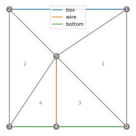

# Electric field around a resistive wire

We want to calculate the electric field around an electric wire. For this, we need to solve the Laplace equation over a domain with a one-dimensional boundary cutting into it.

# Domain and mesh

We first define a square box and a wire:

```python
from pylab import *
import pyFreeFem as pyff

box_points = [ [ .5, 0 ], [.5,1], [-.5,1], [-.5,0] ]
wire_points = [ [0,0],[0,.2],[.1,.4] ]
```

We then build the mesh, and define the two boundaries.

```python
Th = pyff.TriMesh( *array( box_points + wire_points ).T )
Th.add_boundary_edges( [ len( box_points ) ] + list( arange( len( box_points ) ) ) + [ len( box_points ) ] , 'box' )
Th.add_boundary_edges( range( len( box_points ), len( box_points ) + len( wire_points ) ) , 'wire' )
```

Here is the result:

```python
Th.plot_triangles( color = 'grey', labels = 'index' )
Th.plot_boundaries()
Th.plot_nodes( color = 'grey', labels = 'index' )

legend(loc = 'upper center')

axis('scaled')
axis('off')
show()
```


